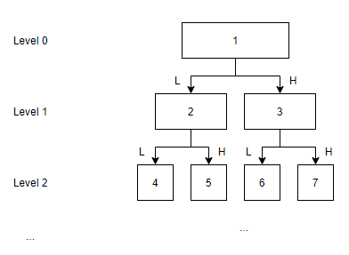
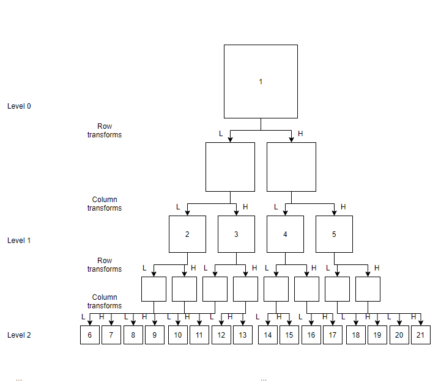
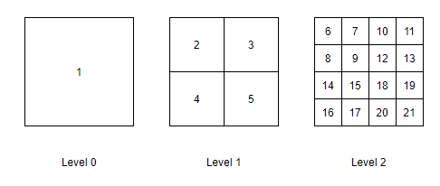

# [Extracting the best bases from signals](@id bestbasis_manual)
The Wavelets.jl's package contains a best basis algorithm that search for the basis tree
within a single signal $x$ such that the Shannon's Entropy or the Log Energy Entropy of the
basis of the signal is minimized, ie. ``\min_{b \in B} M_x(b)``, where  
- ``B`` is the collection of bases for the signal ``x``,
- ``b`` is a basis for the signal ``x``, and
- ``M_x(.)`` is the information cost (eg. Shannon's entropy or Log Energy entropy) for
the basis of signal ``x``. 

However, the challenge arises when there is a need to work on a group of signals $X$ and
find a single best basis $b$ that minimizes the information cost $M_x$ for all $x \in X$, ie. ``\min_{b \in B} \sum_{x \in X} M_x(b)``

A brute force search is not ideal as its computational time grows exponentially to the
number and size of the signals. Here, we have the two efficient
algorithms for the estimation of an overall best basis:
- Joint Best Basis (JBB),
- Least Statistically Dependent Basis (LSDB)

## Best basis representations
To represent a best basis tree in the most memory efficient way, Wavelets.jl uses Julia's
`BitVector` data structure to represent a binary tree that corresponds to the bases of 1D
signals. The indices of the `BitVector`s correspond to nodes of the trees as follows:

|Figure 1: Binary tree structure | Figure 2: Binary tree indexing |
|:---:|:---:|
| | |

where L corresponds to a low pass filter and H corresponds to a high pass filter.

Similarly, a quadtree, used to represent the basis of a 2D wavelet transform, uses a
`BitVector` with the following indexing:

|Figure 3: Quadtree structure | Figure 4: Quadtree indexing |
|:---:|:---:|
| | |

## Examples
### Best Basis of each signal
Assume we are given a large amount of signals to transform to its best basis, one may use
the following approach.

```@example wt
using Wavelets, WaveletsExt, Plots

# Generate 4 Heavy Sine signals
x = generatesignals(:heavysine, 7)
X = duplicatesignals(x, 4, 2, true, 0.5)

# Construct wavelet
wt = wavelet(WT.haar)

# Decomposition of all signals
xw = wpdall(X, wt)

# Best basis trees, each column corresponds to 1 tree
trees = bestbasistree(xw, BB()); 
nothing # hide
```
One can then view the selected nodes from the best basis trees using the [`plot_tfbdry`](@ref WaveletsExt.Visualizations.plot_tfbdry) function as shown below.

```@example wt
# Plot each tree
p1 = plot_tfbdry(trees[:,1])
plot!(p1, title="Signal 1 best basis")
p2 = plot_tfbdry(trees[:,2])
plot!(p2, title="Signal 2 best basis")
p3 = plot_tfbdry(trees[:,3])
plot!(p3, title="Signal 3 best basis")
p4 = plot_tfbdry(trees[:,4])
plot!(p4, title="Signal 4 best basis")

# Draw all plots
plot(p1, p2, p3, p4, layout=(2,2))
```

### Generalized Best Basis Algorithm
Similarly, we can also find the best basis of the signals using Joint Best Basis (JBB) and Least Statistically Dependent Basis (LSDB). Note that these algorithms return 1 basis tree that generalizes the best basis over the entire set of signals.
```@example wt
# JBB
tree = bestbasistree(xw, JBB())
p5 = plot_tfbdry(tree)

# LSDB
tree = bestbasistree(xw, LSDB())
p6 = plot_tfbdry(tree)

# Show results
plot!(p5, title="JBB")
plot!(p6, title="LSDB")
plot(p5, p6, layout=(1,2))
```
