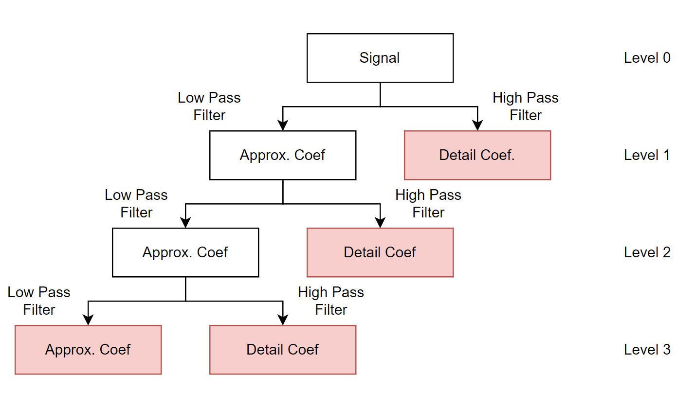

# [Wavelet Transforms](@id transforms_manual)
Wavelet transform is a feature extraction process for decomposing signals into high and low
frequency segments. Using a pair of orthonormal wavelet ``\psi \in L^2(\mathbb{R})``, where
``L^2(\mathbb{R})`` is a Hilbert space of square integrable functions, one can compute
- ``y_{low} = g(x)`` where ``x`` is the signal of interest, ``g`` is the low pass filter
  corresponding to ``\psi``, and ``y_{low}`` is the output when ``x`` passes through ``g``.
- ``y_{high} = h(x)`` where ``x`` is the signal of interest, ``h`` is the high pass filter
  corresponding to ``\psi``, and ``y_{high}`` is the output when ``x`` passes through ``h``.

The wavelet transform can be thought of as an improvement over the Fourier transform due to
its ability to preserve information in both the time and frequency domains. It has vast
applications in fields such as signal analysis and image compression.

As an extension to [Wavelets.jl](https://github.com/JuliaDSP/Wavelets.jl), WaveletsExt.jl
offers additional (redundant) wavelet transform techniques via [autocorrelation wavelet
transforms](@ref ac_transforms) (Beylkin, Saito), [stationary wavelet transforms](@ref
s_transforms) (Nason, Silverman), and [shift invariant wavelet transform](@ref
si_transforms) (Cohen et. al.).

## Wavelet Transform Methods
There are essentially 3 methods of wavelet transforms: discrete wavelet transforms, wavelet
packet transforms, and wavelet packet decomposition. The overall idea of signals being
decomposed into high and low frequency segments remain the same, but the number of levels of
decomposition for each segment may vary.
### Discrete Wavelet Transforms (DWT)
The discrete wavelet transfrom only iteratively decomposes the approximation coefficients at each level, ie. iteratively transforms the output from the low pass filter. The coefficients of the leaf nodes are returned. See Figure 1 for a visualization of the DWT transform process and output.
### Wavelet Packet Transforms (WPT)
The wavelet packet transform takes the decomposition process one step further and itereatively decomposes on both the approximation and detail coefficients, ie. both the outputs from the low pass filter and high pass filter are being iteratively decomposed. The coefficients of the leaf nodes are returned.

An extension to WPT is that one can decompose a signal based on a given tree. See Figure 1 for better visualization of the transform process.

### Wavelet Packet Decomposition (WPD)
The wavelet packet decomposition functions similarly to WPT, except that all the coefficients (regardless of whether they're at the lead node) are retained in the output. The WPD is useful for selecting the [wavelet best basis](@ref bestbasis_manual) and feature extraction algorithms such as [Local Discriminant Basis](@ref ldb_manual).

| Discrete Wavelet Transform | Wavelet Packet Transform | Wavelet Packet Decomposition|
|:---:|:---:|:---:|
|  |  |  |
||  ||

Figure 1: Decomposition method for DWT, WPT, and WPD respectively. Coefficient outputs from DWT, WPT, and WPD are highlighted in red.
## Types of Wavelet Transforms and Their Examples in WaveletsExt.jl
### Regular Wavelet Transform
The standard wavelet transform (DWT and WPT) from Wavelets.jl and the WPD can be performed
as follows:
```@example wt
using Wavelets, WaveletsExt

# Define function and wavelet
x = generatesignals(:heavysine, 8)
wt = wavelet(WT.db4)

# ----- Discrete Wavelet Transform (DWT) -----
y = dwt(x, wt)      # Forward transform
z = idwt(y, wt)     # Inverse transform

# ----- Wavelet Packet Transform (WPT) -----
y = wpt(x, wt)      # Forward transform
z = iwpt(y, wt)     # Inverse transform

# ----- Wavelet Packet Decomposition (WPD) -----
y = wpd(x, wt)      # Decompose into L levels
nothing # hide
```

In the case where there are multiple signals to transform, one may opt for [`dwtall`](@ref WaveletsExt.DWT.dwtall), [`wptall`](@ref WaveletsExt.DWT.wptall), and [`wpdall`](@ref WaveletsExt.DWT.wpdall).

### [Stationary Wavelet Transforms] (@id s_transforms)
The stationary wavelet transform is a redundant type of wavelet transform. This means that there are no downsampling involved unlike the standard transforms, resulting in an exponentially larger number of coefficients compared to that of the standard transforms. A strength of the stationary wavelet transform is its ability to retain more information, thereby being more useful in certain signal analysis applications such as denoising. However, it also takes an exponentially larger amount of time and space to decompose a signal compared to the standard transforms.

```@example wt
# ----- Discrete Wavelet Transform (DWT) -----
y = sdwt(x, wt)     # Forward transform
z = isdwt(y, wt)    # Inverse transform

# ----- Wavelet Packet Decomposition (WPD) -----
y = swpd(x, wt)     # Decompose into L levels
nothing # hide
```

### [Autocorrelation Wavelet Transforms] (@id ac_transforms)
The autocorrelation wavelet transforms, similar to the stationary transforms, is a redundant type of wavelet transform. This also means that there is no downsampling involved unlike the standard transforms, and that more information is retained. 

While the decomposition process is still slower than that of the standard transform, its reconstruction process is extremely quick as it only requires the iterative summation of approximation and detail coefficients.
```@example wt
# ----- Discrete Wavelet Transform (DWT) -----
y = acdwt(x, wt)    # Forward transform
z = iacdwt(y)       # Inverse transform

# ----- Wavelet Packet Decomposition (WPD) -----
y = acwpd(x, wt)    # Decompose into L levels
nothing # hide
```

### [Shift Invariant Wavelet Packet Decomposition] (@id si_transforms)
The [Shift-Invariant Wavelet Decomposition (SIWPD)](https://israelcohen.com/wp-content/uploads/2018/05/ICASSP95.pdf) is developed by Cohen et. al.. While it is also a type of redundant transform, it does not follow the same methodology as the SWT and the ACWT. Cohen's main goal for developing this algorithm was to obtain a global minimum entropy from a signal and all its shifted versions. See [its best basis implementation](@ref si_bestbasis) for more information.

One can compute the SIWPD of a single signal as follows.
```@example wt
# decomposition
xw = siwpd(x, wt);
nothing # hide
```

!!! note 
    As of right now, there is not too many functions written based on the SIWPD, as it does not follow the conventional style of wavelet transforms. There is a lot of ongoing work to develop more functions catered for the SIWPD such as it's inverse transforms and group-implementations.


