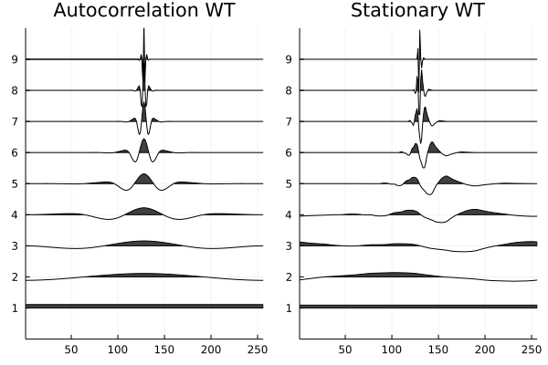

# Summary
Whether it is seismic surveys, ECG signals, stock market trends, or sensor data, the wavelet and wavelet packet transforms are powerful tools for signal analysis and classification with many advantages over the conventional Fourier methods. Primary among them is the ability to extract information localized in both time and frequency domains, enabling multiresolution analysis [@Daubechies:1992; @Mallat:2009]. As such, wavelets and wavelet packets have become popular tools for computational harmonic analysis. `WaveletsExt.jl` was developed to augment `Wavelets.jl` (the existing wavelet toolbox for Julia) by providing routines for wavelet analysis, wavelet packet analysis, and associated utilities.

# Statement of Need
Julia's principle package for wavelets is `Wavelets.jl` [@JuliaDSP:2021], which provides the essential building blocks for data analysis using wavelets. These include 1-D, 2-D, and 3-D wavelet transforms via filter banks or lifting, a range of thresholding functions, and other utilities. However, as a general-purpose package for wavelets, `Wavelets.jl` does not include many targeted and sophisticated methods present in the literature.

`WaveletsExt.jl` (Wavelets Extension) enlarges the wavelet toolbox for Julia by providing a host of wavelet routines such as Stationary Wavelet Transform [@Nason:1995], Autocorrelation Wavelet Transform [@Saito:1993], Local Discriminant Basis [@Saito:1995], and Shift-invariant Wavelet Packet Decomposition [@Cohen:1995]. The package also contains denoising utilities such as SureShrink [@Donoho:1995a] and Relative Error Shrink [@Irion:2017] as well as several data visualization features.

One of the most distinguishing features of `WaveletsExt.jl` is the presence of algorithms for handling an ensemble of input signals. Currently, `Wavelets.jl` implements best basis selection utilities for wavelet packets for a single input. However, it does not include methods for selecting a single best basis for a set of inputs with similar properties (e.g., signals or images belonging to the same class), which is valuable for feature extraction and data compression. To address this, `WaveletsExt.jl` implements the Joint Best Basis (JBB) [@Wickerhauser:1996] and the Least Statistically Dependent Basis (LSDB) [@Saito:2001], which are approximations of the Principal Component Analysis (PCA) and Independent Component Analysis (ICA) respectively, obtained via a dictionary of orthonormal bases.

# Examples
## 1. Redundant Wavelet Transforms
`WaveletsExt.jl` implements several redundant wavelet transforms including Stationary Wavelet Transform (SWT) [@Nason:1995] and Autocorrelation Wavelet Transform (a special case of SWT) [@Saito:1993]. These transformations can be performed using the `acdwt` and `sdwt` functions. Users can also visualize the resulting decomposition with the `wiggle` function.

```julia
using Plots, Wavelets, WaveletsExt

x = zeros(1<<8) # Generate a unit impulse (dirac delta) signal
x[128] = 1
wt = wavelet(WT.db4)  # Construct Daubechies 4-tap wavelet filter

# ----- Autocorrelation Wavelet Transforms -----
y = acdwt(x, wt)
p1 = wiggle(y) |> p -> plot!(p, yticks=1:9, title="Autocorrelation WT")

# ----- Stationary Wavelet Transforms -----
y = sdwt(x, wt)
p2 = wiggle(y) |> p -> plot!(p, yticks=1:9, title="Stationary WT")

# Combine and save plot
p = plot(p1, p2, layout=(1,2), size=(600,300))
savefig(p, "transforms.png")
```


## Best Basis Algorithms
`WaveletsExt.jl` can select a best basis for a multiple signal input (i.e., an array of signals) through the Joint Best Basis (JBB) [@Wickerhauser:1996] or Least Statistically Dependent Basis (LSDB) [@Saito:2001] algorithms. The resulting best basis tree can be visualized using `plot_tfbdry`.

```julia
using Plots, Wavelets, WaveletsExt

# Generate 100 noisy heavysine signals of length 2⁸
x = generatesignals(:heavysine, 8) |> 
    x -> duplicatesignals(x, 100, 2, true, 0.5)

# Wavelet packet decomposition of all signals
xw = wpdall(x, wt)

# ----- Joint Best Basis (JBB)
tree = bestbasistree(xw, JBB())
p1 = plot_tfbdry(tree, nd_col=:black, ln_col=:black, bg_col=:white) |> 
     p -> plot!(p, title="JBB")

# ----- Least Statistically Dependent Basis (LSDB)
tree = bestbasistree(xw, LSDB())
p2 = plot_tfbdry(tree, nd_col=:black, ln_col=:black, bg_col=:white) |> 
     p -> plot!(p, title="LSDB")

# Combine and save plot
p = plot(p1, p2, layout=(1,2), size=(600,300))
savefig(p, "bestbasis.png")
```
![The best basis trees of 100 HeaviSine signals (A sinusoid + two Heaviside step functions) [@Donoho:1995a; @Donoho:1995b] with Gaussian noise selected by the JBB and LSDB algorithms. Each row corresponds to a decomposition level, where level 0 is the original input signal, and each cell represents a frequency subband (low to high frequency from left to right). The green colored cells indicate those subbands selected by the JBB (left plot) and the LSDB (right plot) algorithms.  \label{fig:bestbasis}](bestbasis.png)

## Denoising Algorithms
`WaveletsExt.jl` contains two functions for denoising: `denoise` and `denoiseall`. The former denoises a single signal input whereas the latter denoises multiple signal input. For more examples of denoising algorithms in `WaveletsExt.jl`, refer to [@Liew:2021].

```julia
using Plots, Wavelets, WaveletsExt

# Generate 6 circularly shifted HeaviSine signals
x₀ = generatesignals(:heavisine, 8) |> 
     x -> duplicatesignals(x, 6, 2, false)
# Generate 6 noisy versions of the original signals
x = generatesignals(:heavisine, 8) |> 
    x -> duplicatesignals(x, 6, 2, true, 0.8)

# Decompose each noisy signal
xw = wpdall(x, wt)

# Get best basis tree from the decomposition of signals
bt = bestbasistree(xw, JBB())
# Get best basis coefficients based on best basis tree
y = bestbasiscoef(xw, bt)

# Denoise all signals based on computed best basis tree
x̂ = denoiseall(y, :wpt, wt, tree=bt)

# Plot results
p1 = plot(title="Noisy Signals")
wiggle!(x₀, sc=0.7, FaceColor=:white, ZDir=:reverse)
wiggle!(x, sc=0.7, FaceColor=:white, ZDir=:reverse)

p2 = plot(title="Denoised Signals")
wiggle!(x₀, sc=0.7, FaceColor=:white, ZDir=:reverse)
wiggle!(x̂, sc=0.7, FaceColor=:white, ZDir=:reverse)

# Combine and save plot
p = plot(p1, p2, layout=(1,2), size=(600,300))
savefig(p, "denoising.png")
```
![Left: HeaviSine signals with Gaussian noise. Black lines represent the original (non-noisy) signal. Right: Simultaneously denoised signals via the JBB algorithm with threshold determined using the VisuShrink method [@Donoho:1994]. \label{fig:denoising}](denoising.png)

## Feature Extraction
Users can extract distinguishing features of signals localized in time and frequency using the Local Discriminant Basis (LDB) algorithm. Further details can be found in the original papers by Saito and his collaborators [@Saito:1995; @Saito:2002] as well as the interactive tutorial [@Dan:2021].

```julia
using Plots, Wavelets, WaveletsExt

# Generate 100 signals for each class of cylinder-bell-funnel
X, y = generateclassdata(ClassData(:cbf, 100, 100, 100))
# View sample signals and how each class differs from one another
cylinder = wiggle(X[:,1:5], sc=0.3, EdgeColor=:white, FaceColor=:white)
plot!(cylinder, yticks=1:5, ylabel="Cylinder")
bell = wiggle(X[:,101:105], sc=0.3, EdgeColor=:white, FaceColor=:white)
plot!(bell, yticks=1:5, ylabel="Bell")
funnel = wiggle(X[:,201:205], sc=0.3, EdgeColor=:white, FaceColor=:white)
plot!(funnel, yticks=1:5, ylabel="Funnel")
p1 = plot(cylinder, bell, funnel, layout=(3,1))

# Instantiate the LDB object
wt = wavelet(WT.coif4)
ldb = LocalDiscriminantBasis(
  wt=wt,
  max_dec_level=7,
  dm=SymmetricRelativeEntropy(),
  en=TimeFrequency(),
  dp=BasisDiscriminantMeasure(),
  top_k=10,
  n_features=10 # Number of features to extract
)
                            
# Extract features using LDB
X̂ = fit_transform(ldb, X, y)

# Plot the best basis for feature extraction
p2 = plot_tfbdry(ldb.tree, nd_col=:black, ln_col=:black, bg_col=:white)
plot!(p2, title="Basis Selection using LDB")

# Combine and save plot
p = plot(p1, p2, size=(600,300))
savefig(p, "ldb.png")
```


# Reproducible Research
`WaveletsExt.jl` was partially inspired by the WaveLab library in MATLAB, which was developed to enable reproducible wavelet research [@Donoho:1995b]. In this spirit, we wrote a series of tutorials, examples, and experiments using `Pluto.jl` [@Liew:2021; @Dan:2021], a platform with which Julia users can create and share reactive documents [@Fonsp:2021]. By downloading and running these so-called Pluto notebooks, researchers and students alike can reproduce the results of our research and interactively adjust parameters to see the changes in experiment outcomes.

# Acknowledgements
This project was partially supported by the following grants from the US National Science Foundation: DMS-1148643; DMS-1418779; DMS-1912747; and CCF-1934568.

# References
